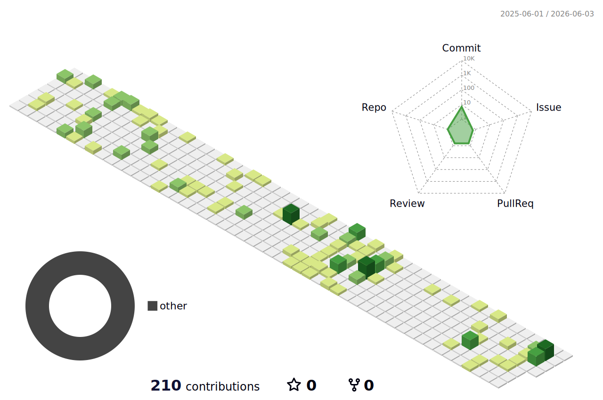

  <h1>Hi there, I'm Piotr! 👋</h1>
  <h3>Fullstack Developer | Problem Solver | Tech Enthusiast</h3>
  
  

    I am a Fullstack Developer with a strong track record of crafting diverse applications—ranging from scalable web platforms to tailored business solutions across various industries. I am deeply passionate about continuous growth, performance efficiency, and leveraging modern technologies to build impactful software that solves real-world problems.
  

---

  <h2>🛠️ My Tech Stack</h2>
  
Technologies and tools I use to bring ideas to life:

  
  <!-- Skill icons automatically adapt to GitHub's theme, but we force them to look great on both -->
  

---

  <h2>📊 GitHub Analytics</h2>
  
  <!-- Stats Card (Supports Dark and Light mode via GitHub's picture tag) -->
  <picture>
    <source media="(prefers-color-scheme: dark)" srcset="https://github-readme-stats.vercel.app/api?username=Pioskl&show_icons=true&theme=transparent&hide_border=true&title_color=58A6FF&icon_color=58A6FF&text_color=C9D1D9">
    <source media="(prefers-color-scheme: light)" srcset="https://github-readme-stats.vercel.app/api?username=Pioskl&show_icons=true&theme=transparent&hide_border=true&title_color=0969DA&icon_color=0969DA&text_color=24292F">
    
  </picture>

  <!-- Top Languages Card -->
  <picture>
    <source media="(prefers-color-scheme: dark)" srcset="https://github-readme-stats.vercel.app/api/top-langs/?username=Pioskl&layout=compact&theme=transparent&hide_border=true&title_color=58A6FF&text_color=C9D1D9">
    <source media="(prefers-color-scheme: light)" srcset="https://github-readme-stats.vercel.app/api/top-langs/?username=Pioskl&layout=compact&theme=transparent&hide_border=true&title_color=0969DA&text_color=24292F">
    
  </picture>

---

  <h2>📈 My Contribution Graph (3D)</h2>
  
A different perspective on my daily commits and activity.

  
  <!-- 3D Contribution Graph (Requires the GitHub Action below) -->
  <picture>
    <source media="(prefers-color-scheme: dark)" srcset="./profile-3d-contrib/profile-night-rainbow.svg">
    <source media="(prefers-color-scheme: light)" srcset="./profile-3d-contrib/profile-green.svg">
    
  </picture>

